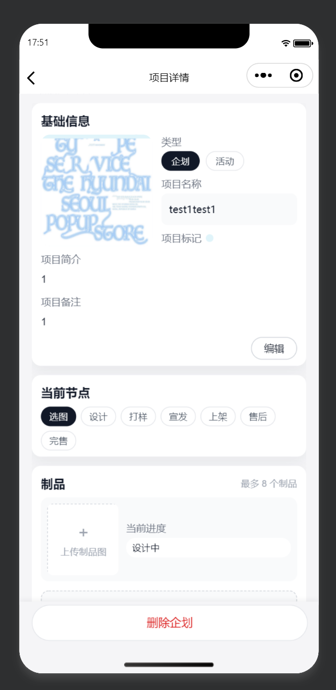
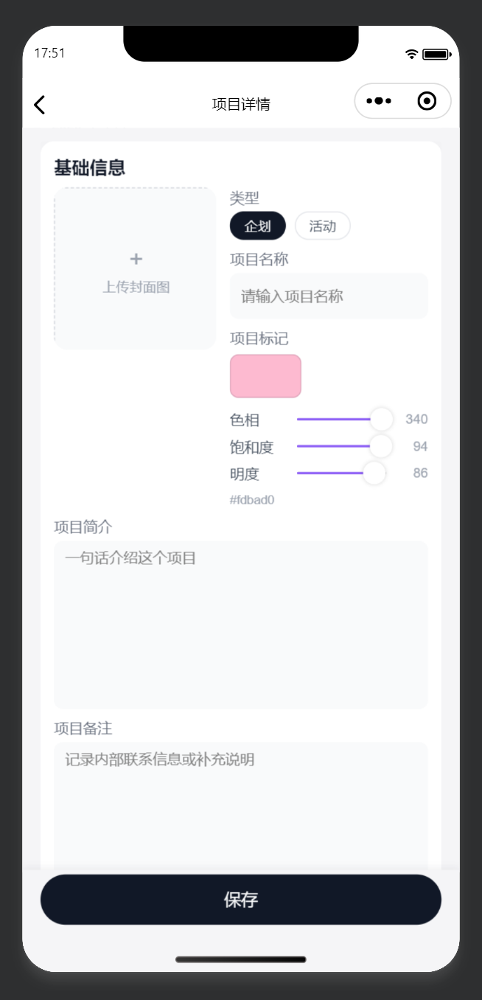
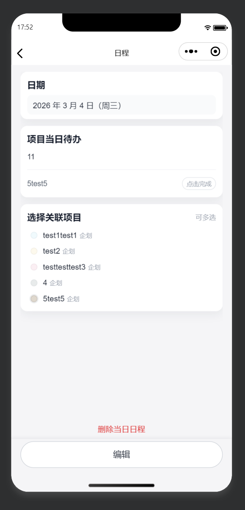
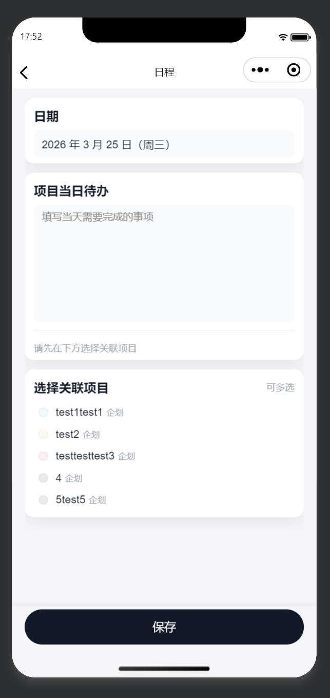

# 游戏衍生品企划日历

一款基于微信小程序的企划/活动项目管理与日程工具，支持多项目并行、按日排期与进度可视化。

## 预览

| 企划预览界面 | 企划编辑界面 |
|--------------|--------------|
|  |  |

| 日程预览界面 | 日程编辑界面 |
|--------------|--------------|
|  |  |

## 功能概览

- **月历一览**：本月/下月滑动切换，日期格按关联企划显示颜色，已完成节点日期显示爱心标记，无关联企划的日程显示圆点提示。
- **企划管理**：最多 9 个企划，每个企划支持封面图、类型（企划/活动）、名称、简介与备注、自定义颜色标记、七段式进度节点（选图 → 设计 → 打样 → 宣发 → 上架 → 售后 → 完售），以及最多 8 个制品（含图片与进度：设计中/打样中/已完成）。
- **日程管理**：按日期填写当日待办，多选关联多个企划，支持标记「已完成」；完成状态同步到首页月历显示爱心。

## 项目结构

```
miniprogram-1/
├── app.js                 # 小程序入口
├── app.json               # 全局配置（页面、窗口等）
├── app.wxss               # 全局样式
├── pages/
│   ├── index/             # 首页：月历 + 企划封面
│   ├── new-project/       # 新建/编辑/查看企划
│   └── schedule/          # 按日日程（待办 + 关联项目）
├── components/
│   └── navigation-bar/    # 自定义导航栏组件
└── sitemap.json
```

## 本地运行

1. 安装 [微信开发者工具](https://developers.weixin.qq.com/miniprogram/dev/devtools/download.html)。
2. 用微信开发者工具打开本项目目录。
3. 选择「小程序」并填入 AppID（体验可使用测试号）。
4. 编译后在模拟器或真机预览。

## 技术说明

- **框架**：微信小程序原生（WXML / WXSS / JavaScript）
- **数据**： `wx.getStorageSync`（`projects` 企划列表、`schedules` 按日日程）
- **样式**：小程序 style v2，自定义导航栏适配安全区。

## 许可证

仅供学习与个人使用。
